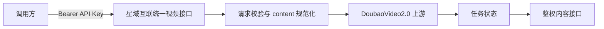

# 星域互联（Starnexus）Doubao Seedance 系列视频生成接入规范

**文档版本：** 1.3
**适用范围：** DoubaoVideo2.0 渠道（渠道类型 62）的 Seedance 系列视频模型
**读者：** API 调用方、业务后端、客户端 SDK 和运维人员

本文说明如何通过星域互联（Starnexus）统一视频接口提交 DoubaoVideo2.0 视频任务。默认情况下，该渠道把 URL、数据 URL 或上传文件直接转换为上游 `content`；管理员也可以为公开图片 URL 启用独立的 Kuaizi 素材库自动化。

## 1. 接口流程



调用方负责：

1. 调用视频生成接口；
2. 传入可访问的 HTTPS 图片 URL、数据 URL 或纯 Base64 图片；
3. 保存接口返回的公开任务 ID；
4. 轮询任务状态，并通过内容接口读取结果。

调用方和网关均不需要管理素材组、素材凭据或内部素材引用。公网 URL 必须在上游读取期间保持可用；上传文件则由网关直接转换为数据 URL 后转发。

## 2. 认证

```http
Authorization: Bearer sk-your-api-key
Content-Type: application/json
```

API Key 仅用于星域互联（Starnexus）服务。不要把管理员密钥、素材凭据或其他内部配置发送给最终用户。

## 3. 创建视频任务

```http
POST /v1/video/generations
```

示例：

```json
{
  "model": "doubao-seedance-2-0-260128",
  "prompt": "人物轻微转头，保持面部稳定，固定机位",
  "images": [
    "https://cdn.example.com/portrait.jpg"
  ],
  "seconds": "5",
  "metadata": {
    "resolution": "720p"
  }
}
```

字段说明：

| 字段 | 类型 | 必填 | 说明 |
|---|---|---:|---|
| `model` | string | 是 | Doubao Seedance 系列模型名称，以服务端模型列表为准 |
| `prompt` | string | 是 | 视频生成提示词 |
| `images` | string[] | 否 | 图片 URL、数据 URL 或纯 Base64；多图数量以具体模型能力为准 |
| `image` | string | 否 | 单图兼容字段，服务端会转换为 `images` |
| `seconds` | string | 否 | 视频时长，建议传字符串，例如 `"5"` |
| `duration` | integer | 否 | 时长兼容字段；优先使用 `seconds` |
| `metadata` | object | 否 | 模型支持的扩展字段，例如 `resolution`、`ratio` 等 |

创建成功后，响应中的 `id` 或 `task_id` 是公开任务 ID。调用方不得依赖或猜测内部任务标识。

### 3.1 OpenAI Videos 兼容接口

```http
POST /v1/videos
```

JSON 请求可以使用对象形式（推荐）或历史字符串形式的 `input_reference`：

```json
{
  "model": "doubao-seedance-2-0-260128",
  "prompt": "人物轻微转头，保持面部稳定",
  "input_reference": {
    "image_url": "https://cdn.example.com/portrait.jpg"
  },
  "seconds": "8",
  "size": "1280x720"
}
```

也可直接传 DoubaoVideo2.0 上游兼容的顶层 `content` 数组。`content` 与 `input_reference`、`image`、`images` 互斥；一个请求中最多有一个文本项、一个 `first_frame` 和一个 `last_frame`，且 `last_frame` 必须同时提供 `first_frame`。

## 4. 图片传输规范

### 4.1 支持的传输形式

HTTPS URL：

```json
{
  "images": ["https://cdn.example.com/portrait.jpg"]
}
```

数据 URL：

```json
{
  "images": ["data:image/png;base64,iVBORw0KGgoAAA..."]
}
```

也兼容不带 `data:` 前缀的纯 Base64 字符串。不过内联媒体会被放进上游 JSON，Base64 相比原始二进制约膨胀三分之一；上游还会持久化整份请求体，因此只适合很小的输入。生产调用应优先使用稳定的公网 URL，或让符合条件的公网图片进入素材库。

### 4.2 支持的图片格式

| 格式 | MIME 类型 | 说明 |
|---|---|---|
| JPEG/JPG | `image/jpeg`、`image/jpg` | 支持 EXIF 方向校正 |
| PNG | `image/png` | 支持透明图；必要时会转换为 JPEG |
| WebP | `image/webp` | 支持静态 WebP |
| GIF | `image/gif` | 检查基于解码后的图像帧 |

暂不支持 HEIC/HEIF、BMP、TIFF、SVG、PDF，以及其他无法解码的非光栅图片格式。

### 4.3 本地文件

原生接口 `/v1/video/generations` 使用 JSON，不接受把二进制图片作为 multipart 文件提交。本地文件可先转换为数据 URL，或上传到稳定的对象存储。

兼容接口 `/v1/videos` 额外接受名为 `input_reference` 的 multipart 图片文件：

```bash
curl https://gateway.example.com/v1/videos \
  -H "Authorization: Bearer sk-your-api-key" \
  -F "model=doubao-seedance-2-0-260128" \
  -F "prompt=人物轻微转头" \
  -F "seconds=8" \
  -F "size=1280x720" \
  -F "input_reference=@portrait.jpg"
```

文件必须是 JPEG、PNG、GIF 或 WebP，入口文件大小为 1 byte～20 MB。启用 DoubaoVideo2.0 R2 临时存储后，网关会把所有 Base64 和 multipart 内联媒体上传到私有 R2，再向上游发送短期预签名 URL；上游直接从 Cloudflare 读取，不经过应用节点。R2 未配置时，小型内联请求保留历史直传行为，最终上游 JSON 超过 60 KiB 则返回 HTTP 413，避免触发上游 MySQL `request_body` 容量错误。

## 5. 公网 URL 要求

当传入 URL 时，DoubaoVideo2.0 上游会读取该 URL，因此图片 URL 必须满足：

- 使用 HTTPS；
- 无需 Cookie、登录态或临时请求头即可访问；
- 返回正确的图片 `Content-Type`；
- 不跳转到登录页或 HTML 页面；
- 在任务完成前持续有效；
- 不限制服务端或生成节点的访问来源。

如果无法保证现有 URL 稳定性，可使用下述 R2 客户端直传接口；文件字节不会经过应用服务器。已有公网 HTTP(S) URL 继续直接透传，不重复下载和上传。

### 5.1 素材库自动化

DoubaoVideo2.0 的素材配置位于渠道编辑页的“DoubaoVideo2.0 素材设置”，与 ZQBAPI 的凭证、配置和素材记录完全独立。素材 API 复用当前渠道的 Kuaizi `ApiKey`，并要求填写同一账号下已审核的 AIGC 素材组 ID。

- `off`（默认）：不调用素材 API，保持历史行为。
- `retry_only`：先直接提交；上游明确以真人素材相关原因拒绝时，把公开图片 URL 创建为素材并仅重提一次。
- `face_preflight`：本地检测到人脸时先创建素材；未命中的公开图片仍保留一次失败恢复机会。
- `always`：所有公开图片 URL 都先创建素材。

创建素材调用 `CreateAsset`，轮询 `GetAsset` 直到状态为 `Active`，随后把请求中的图片改为 `asset://<Id>`。创建结果通过独立数据库表进行跨节点幂等复用；数据库不会保存源图片 URL 或图片字节。

公开素材 API 只接收可由上游访问的 HTTP(S) URL，不支持 multipart、`data:` URL 或 base64 字节上传。启用 R2 后，内联图片会先转换成可访问的短期 URL，再进入普通素材库前置判断；未启用 R2 时仍按各素材模式的原有规则处理。

素材创建是非幂等操作。网关不会在网络结果不确定时自动重复 `CreateAsset`，避免生成重复素材；`GetAsset` 等只读查询允许有限重试。

## 6. 图片限制

- URL 下载大小受服务端配置限制，默认不超过 64 MB；
- 请求体默认不超过 128 MB；
- `/v1/videos` multipart 入口单文件不超过 20 MB；R2 直传或自动外置媒体不超过 64 MB；
- 未配置 R2 时，DoubaoVideo2.0 最终上游 JSON 含 Base64/data URL 等内联媒体不超过 60 KiB，超限返回 HTTP 413 且不重试；
- 公网 URL 和 `asset://` 仅在 JSON 中保存短引用，不受内联媒体体积保护限制；
- 最终尺寸、比例及引用数量必须符合所选 Seedance 模型能力。

推荐优先使用 R2 客户端直传；需要兼容既有客户端时，可继续提交 Base64 或 multipart，由网关自动外置。

### 6.1 R2 临时媒体与客户端直传

```env
DOUBAO_VIDEO2_R2_ENDPOINT=https://<account-id>.r2.cloudflarestorage.com
DOUBAO_VIDEO2_R2_ACCESS_KEY_ID=<R2 S3 access key id>
DOUBAO_VIDEO2_R2_SECRET_ACCESS_KEY=<R2 S3 secret access key>
DOUBAO_VIDEO2_R2_BUCKET=starnexus-video-inputs
DOUBAO_VIDEO2_R2_URL_TTL_SECONDS=86400
```

Bucket 保持私有。网关使用 S3 SigV4 上传并生成默认 24 小时有效的 R2 GET URL；应为 `doubao-video2/` 前缀配置 24 小时生命周期删除规则。对象名使用加密随机值，日志不记录对象内容、凭证或完整预签名 URL。

客户端完全直传流程：

```http
POST /v1/video-inputs/presign
Authorization: Bearer sk-...
Content-Type: application/json

{"content_type":"image/png","content_length":123456,"checksum_sha256":"<文件 SHA-256 的 Base64>"}
```

响应中的 `upload_url` 用于一次 `PUT` 文件，必须携带响应 `headers`。PUT 成功后，把 `object_id` 和 `complete_token` 提交到 `POST /v1/video-inputs/complete`；网关通过 R2 HEAD 校验真实对象大小和类型后，才返回上游可读的 `media_url`。最后把 `media_url` 放入 `/v1/videos` 的 `input_reference` 或 `content[].image_url.url`。支持 JPEG、PNG、WebP、GIF、MP4、WebM、MP3、WAV、M4A，单对象最大 64 MB；SHA-256 不匹配的上传由 R2 直接拒绝。

```http
POST /v1/video-inputs/complete
Authorization: Bearer sk-...
Content-Type: application/json

{"object_id":"<presign 返回值>","complete_token":"<presign 返回值>"}
```

### 6.2 计费配置

DoubaoVideo2.0 的模型基础倍率仍由管理端模型倍率配置决定。若需要按分辨率和是否含视频输入区分倍率，应为实际启用的模型配置 `VideoTokenPrice`；尤其是新增的 mini、2.5 或未来模型，不应套用其他型号的未验证价格。

## 7. 查询任务

```http
GET /v1/video/generations/{task_id}
```

必须使用创建任务响应中的公开任务 ID。

常见状态：

| 状态 | 含义 |
|---|---|
| `QUEUED` / `queued` | 已排队 |
| `SUBMITTED` | 已提交生成服务 |
| `IN_PROGRESS` / `in_progress` | 生成中 |
| `RETRYING` | 正在进行一次自动素材恢复，应继续等待 |
| `SUCCESS` / `completed` | 已完成 |
| `FAILURE` / `failed` | 失败 |

建议以 2～5 秒间隔轮询。`RETRYING` 属于处理中状态，不应立即创建重复任务。

## 8. 读取视频内容

任务完成后调用：

```http
GET /v1/videos/{task_id}/content
```

该接口需要 API Key 或有效登录态，并支持 HTTP Range，可用于断点下载和播放器拖动。

## 9. 错误处理

| 错误码 | HTTP | 含义 | 调用方建议 |
|---|---:|---|---|
| `invalid_image` | 422 | 图片格式、尺寸、比例或解码失败 | 更换或重新编码图片 |
| `invalid_reference_role` | 400 | 首尾帧角色组合无效 | 修正 `content[].role` 后重新提交 |
| `reference_image_download_failed` | 失败任务 | 上游无法下载图片 URL | 改用稳定公网 URL 或 multipart 文件 |
| `video_generation_failed` | 失败任务 | 上游生成失败且没有可公开的详细原因 | 使用任务 ID 联系管理员查询内部日志 |

如果创建请求超时且未收到完整响应，不要立即重复提交，以免产生重复计费任务。应先依据业务侧记录查询任务；无法确认时，请结合请求时间和请求 ID 联系服务管理员排查。

## 10. 推荐接入策略

1. 图片统一转换为 JPEG、PNG 或 WebP；
2. 使用稳定 HTTPS URL 或带 MIME 的 Base64 数据 URL；
3. 5 秒视频传 `seconds: "5"`；
4. 创建成功后立即保存公开任务 ID；
5. 按 2～5 秒间隔轮询，遇到 `RETRYING` 继续等待；
6. 完成后通过 `/v1/videos/{task_id}/content` 获取视频；
7. 不创建或管理素材组、素材凭据、`file_id` 或内部素材引用。
