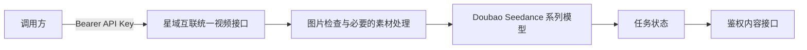

# 星域互联（Starnexus）Doubao Seedance 系列视频生成接入规范

**文档版本：** 1.1
**适用范围：** Doubao Seedance 系列视频模型
**读者：** API 调用方、业务后端、客户端 SDK 和运维人员

本文说明如何通过星域互联（Starnexus）统一视频接口提交 Doubao Seedance 系列图生视频任务。调用方只需要传入 API Key、模型名称、提示词和图片，不需要管理素材组、素材凭据或内部素材引用。

## 1. 接口流程



调用方负责：

1. 调用视频生成接口；
2. 传入可访问的 HTTPS 图片 URL、数据 URL 或纯 Base64 图片；
3. 保存接口返回的公开任务 ID；
4. 轮询任务状态，并通过内容接口读取结果。

素材创建、状态等待、失败恢复和内部素材引用均由服务端自动处理。

## 2. 认证

```http
Authorization: Bearer sk-your-api-key
Content-Type: application/json
```

API Key 仅用于星域互联（Starnexus）服务。不要把管理员密钥、素材凭据或其他内部配置发送给最终用户。

## 3. 创建视频任务

```http
POST /v1/video/generations
```

示例：

```json
{
  "model": "doubao-seedance-2-0-260128",
  "prompt": "人物轻微转头，保持面部稳定，固定机位",
  "images": [
    "https://cdn.example.com/portrait.jpg"
  ],
  "seconds": "5",
  "metadata": {
    "resolution": "720p"
  }
}
```

字段说明：

| 字段 | 类型 | 必填 | 说明 |
|---|---|---:|---|
| `model` | string | 是 | Doubao Seedance 系列模型名称，以服务端模型列表为准 |
| `prompt` | string | 是 | 视频生成提示词 |
| `images` | string[] | 否 | 图片 URL、数据 URL 或纯 Base64；多图数量以具体模型能力为准 |
| `image` | string | 否 | 单图兼容字段，服务端会转换为 `images` |
| `seconds` | string | 否 | 视频时长，建议传字符串，例如 `"5"` |
| `duration` | integer | 否 | 时长兼容字段；优先使用 `seconds` |
| `metadata` | object | 否 | 模型支持的扩展字段，例如 `resolution`、`ratio` 等 |

创建成功后，响应中的 `id` 或 `task_id` 是公开任务 ID。调用方不得依赖或猜测内部任务标识。

## 4. 图片传输规范

### 4.1 支持的传输形式

HTTPS URL：

```json
{
  "images": ["https://cdn.example.com/portrait.jpg"]
}
```

数据 URL：

```json
{
  "images": ["data:image/png;base64,iVBORw0KGgoAAA..."]
}
```

也支持不带 `data:` 前缀的纯 Base64 字符串，但推荐携带完整 MIME 前缀，便于格式识别和问题排查。

### 4.2 支持的图片格式

| 格式 | MIME 类型 | 说明 |
|---|---|---|
| JPEG/JPG | `image/jpeg`、`image/jpg` | 支持 EXIF 方向校正 |
| PNG | `image/png` | 支持透明图；必要时会转换为 JPEG |
| WebP | `image/webp` | 支持静态 WebP |
| GIF | `image/gif` | 检查基于解码后的图像帧 |

暂不支持 HEIC/HEIF、BMP、TIFF、SVG、PDF，以及其他无法解码的非光栅图片格式。

### 4.3 本地文件

视频接口的图片参数是 JSON 字符串引用，不接受把二进制图片直接作为普通 multipart 文件字段提交：

```bash
curl -F "file=@portrait.jpg" ...
```

本地文件应先转换为数据 URL，或上传到可公开访问的对象存储，再把稳定的 HTTPS URL 放入 `image` 或 `images` 字段。

## 5. 公网 URL 要求

服务端可能拉取图片进行格式检查、人脸检测、方向校正、尺寸规范化和必要的素材处理。未触发素材处理时，生成服务可能再次访问原 URL。因此图片 URL 必须满足：

- 使用 HTTPS；
- 无需 Cookie、登录态或临时请求头即可访问；
- 返回正确的图片 `Content-Type`；
- 不跳转到登录页或 HTML 页面；
- 在任务完成前持续有效；
- 不限制服务端或生成节点的访问来源。

如果无法保证 URL 稳定性，推荐直接传带 MIME 的 Base64 数据 URL。

## 6. 图片限制

- URL 下载大小受服务端配置限制，默认不超过 64 MB；
- 请求体默认不超过 128 MB；
- 素材处理后的单张图片小于 30 MB；
- 图片总像素不超过 64 megapixels；
- 宽高比严格位于 `(0.4, 2.5)`；
- 开启自动规范化时，服务端会对过大图片进行缩放和重新编码。

推荐优先使用经过压缩的 JPEG、PNG 或 WebP，避免在请求中发送超大 Base64 图片。

## 7. 查询任务

```http
GET /v1/video/generations/{task_id}
```

必须使用创建任务响应中的公开任务 ID。

常见状态：

| 状态 | 含义 |
|---|---|
| `QUEUED` / `queued` | 已排队 |
| `SUBMITTED` | 已提交生成服务 |
| `IN_PROGRESS` / `in_progress` | 生成中 |
| `RETRYING` | 正在进行一次自动素材恢复，应继续等待 |
| `SUCCESS` / `completed` | 已完成 |
| `FAILURE` / `failed` | 失败 |

建议以 2～5 秒间隔轮询。`RETRYING` 属于处理中状态，不应立即创建重复任务。

## 8. 读取视频内容

任务完成后调用：

```http
GET /v1/videos/{task_id}/content
```

该接口需要 API Key 或有效登录态，并支持 HTTP Range，可用于断点下载和播放器拖动。

## 9. 错误处理

| 错误码 | HTTP | 含义 | 调用方建议 |
|---|---:|---|---|
| `invalid_image` | 422 | 图片格式、尺寸、比例或解码失败 | 更换或重新编码图片 |
| `material_rejected` | 422 | 素材处理失败 | 检查图片内容后重新提交 |
| `material_rate_limited` | 429 | 素材处理被限流 | 延迟后重试 |
| `material_not_configured` | 503 | 服务端素材能力未配置完整 | 联系服务管理员 |
| `material_auth_failed` | 502 | 素材服务认证失败 | 联系服务管理员 |
| `material_transient` | 502 | 素材服务网络或瞬时错误 | 延迟后重试 |

如果创建请求超时且未收到完整响应，不要立即重复提交，以免产生重复计费任务。应先依据业务侧记录查询任务；无法确认时，请结合请求时间和请求 ID 联系服务管理员排查。

## 10. 推荐接入策略

1. 图片统一转换为 JPEG、PNG 或 WebP；
2. 使用稳定 HTTPS URL 或带 MIME 的 Base64 数据 URL；
3. 5 秒视频传 `seconds: "5"`；
4. 创建成功后立即保存公开任务 ID；
5. 按 2～5 秒间隔轮询，遇到 `RETRYING` 继续等待；
6. 完成后通过 `/v1/videos/{task_id}/content` 获取视频；
7. 不直接管理素材组、素材凭据或内部素材引用。
